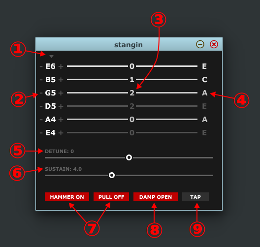

# Stangin

Stangin in a VST plugin to process MIDI sysex messages from the 
[Mad Catz Fender Mustang controller for RockBand 3](https://en.wikipedia.org/wiki/Rock_Band_3#Guitar_and_bass).
This fun controller has MIDI output, but unfortunately the note-on messages it sends are very limited. 
Stangin takes the more informative sysex messages and turns them into a stream of note-on/off messages, 
supporting hammer-on, pull-off, tapping, sustain, alternate tunings, and a virtual capo. 
It's built on the amazing [JUCE](https://www.juce.com/) framework, so it should be portable to other
platforms, but currently I have only built it on Linux. Please file an issue if you'd like to use it on 
Mac OS or Windows and I'll do my best. Better yet, if you have the skills, build it yourself and send me 
a pull request with your binary included.

# Installing

On Linux, download [the plugin binary](https://github.com/jessecrossen/vst-stangin/raw/master/vst/stangin.so)
and save it to wherever you keep your VST plugins, for example to `~/.vst`. When you rescan with your plugin
host, it should appear under the maker "hautmidi".

# Building

1. Install [JUCE](https://www.juce.com/get-juce) and any required libraries. You may need to install the [VST SDK](https://www.juce.com/doc/tutorial_create_projucer_basic_plugin) and other headers for your system.
2. Clone or download this repository.
3. Open `stangin.jucer` with the Projucer application and select **File > Save Project**.
4. Navigate to `Builds/LinuxMakefile` and run `make`.
5. Assuming this works, copy `Builds/LinuxMakefile/build/stangin.so` to wherever you keep your VST plugins.
6. Share and enjoy!

# Features and Usage

1. Drop down a menu of alternate tunings. Please file an issue if there's one you feel should be there.
2. Tune individual strings up and down by clicking the +/- symbols.
3. This shows the current fret positions, and strings light up when played and is handy for making tabs.
4. This shows what note is being fretted on each string and is handy for making scores.
5. Tune all string up or down by any number of semitones.
6. Adjust the maximum sustain of each note in seconds. Actual sustain will vary with velocity.
7. Toggle whether to simulate hammer-on and pull-off techniques while a string is playing.
8. Toggle whether to stop playing a string when all fret buttons are released.
9. Toggle whether to begin playing a string when a fret button is pressed.

# Controller Button Mappings

I have a PlayStation-branded controller, so your buttons might look slightly different. I've tried to 
describe them in a generic way. There's also an internal "button" that seems to trigger when the guitar is shaken. It's not very sensitive, 
and I haven't come up with anything good to do with it yet. Please file an issue if you have an idea!

## Set of 4 Round buttons under the "pickup"
* X button (up): increase sustain (hold to increase continuously)
* Triangle button (down): decrease sustain (hold to decrease continuously)
* Square button (toward head): toggle hammer-on and pull-off
* Circle button (toward tail): toggle tapping

## 4 way arrow button
* Up: tune guitar up by one semitone
* Down: tune guitar down by one semitone
* Right (toward tail): tune guitar up by one octave
* Left (toward head): tune guitar down by one octave

## Other buttons
* Select button: remove all detuning
* Console-branded button: stop all playing strings
* Start button: stop all playing strings and reset all settings
